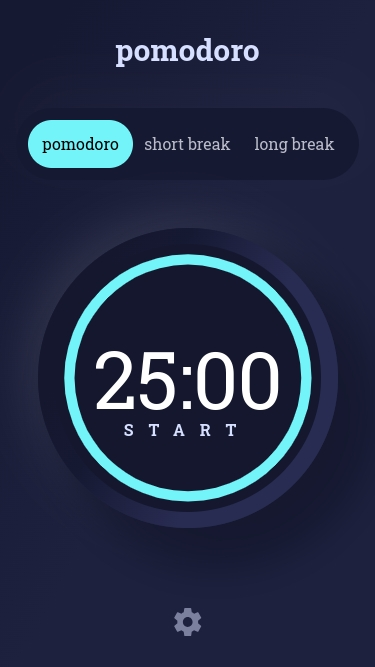
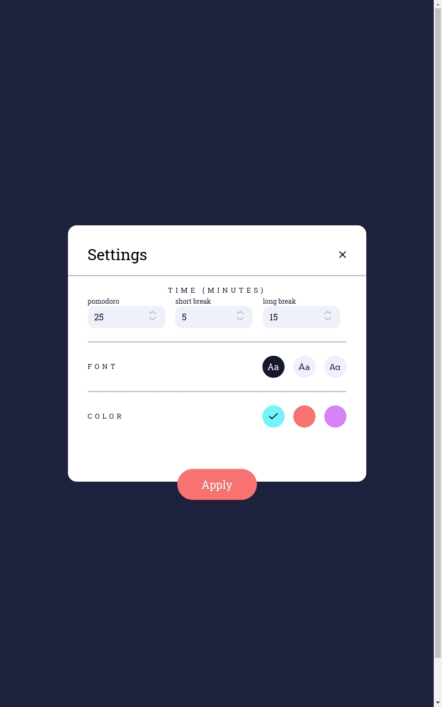
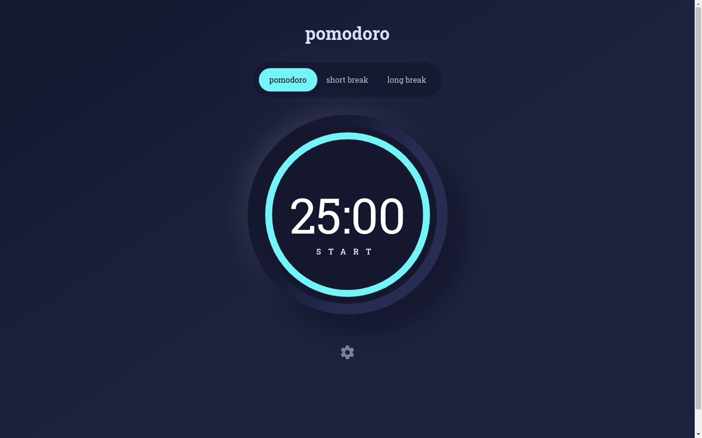

# Frontend Mentor - Pomodoro app solution

This is a solution to the [Pomodoro app challenge on Frontend Mentor](https://www.frontendmentor.io/challenges/pomodoro-app-KBFnycJ6G). Frontend Mentor challenges help you improve your coding skills by building realistic projects. 

## Table of contents

- [Overview](#overview)
  - [The challenge](#the-challenge)
  - [Screenshot](#screenshot)
  - [Links](#links)
  - [Built with](#built-with)
  - [Useful resources](#useful-resources)
- [Author](#author)

**Note: Delete this note and update the table of contents based on what sections you keep.**

## Overview

### The challenge

Users should be able to:

- Set a pomodoro timer and short & long break timers
- Customize how long each timer runs for
- See a circular progress bar that updates every minute and represents how far through their timer they are
- Customize the appearance of the app with the ability to set preferences for colors and fonts

### Screenshot

### Links

- Solution URL: [Add solution URL here](https://your-solution-url.com)
- Live Site URL: [Add live site URL here](https://your-live-site-url.com)

### Built with

- Semantic HTML5 markup
- Flexbox
- CSS Grid
- Mobile-first workflow
- [React](https://reactjs.org/) - JS library
- [Tailwind CSS Documentation](https://tailwindcss.com/)
- [Vite Documentation](https://vitejs.dev/)

## My process

- ** Time Management**: Classic Pomodoro timer with customizable session durations
- ** Modern UI**: Beautiful gradient design with glassmorphism effects
- ** Responsive Design**: Optimized for desktop, tablet, and mobile devices
- ** Customizable Settings**: Adjust work, short break, and long break durations
- ** Theme Options**: Multiple color schemes (Blue, Red, Purple)
- ** Typography Choices**: Three professional font options (Kumbh Sans, Roboto Slab, Space Mono)
- ** Visual Progress**: Circular progress indicator showing time remaining
- ** Session States**: Start, Pause, and Restart functionality

## Author

- GitHub - [Ramiro Fernandez](https://github.com/rf1303)
- Frontend Mentor - [@yourusername](https://www.frontendmentor.io/profile/rf1303)
- Linkedin - [@Ramiro Fernandez](https://www.linkedin.com/in/ramiro-fernandez-260935125/)

